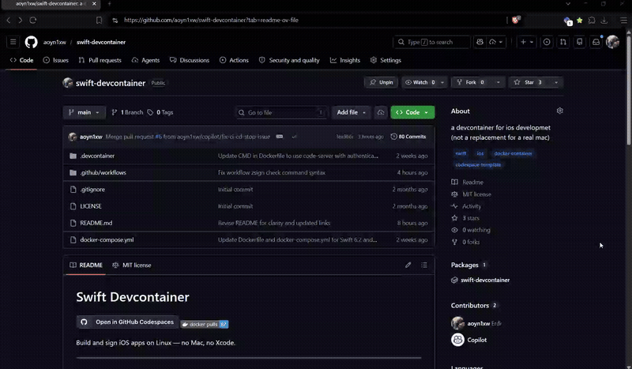

# Swift Devcontainer

[](https://codespaces.new/aoyn1xw/swift-devcontainer?quickstart=1)
[](https://hub.docker.com/r/ayon1xw/swift-devcontainer)

Build and sign iOS apps on Linux — no Mac, no Xcode.



---

## What's Included

| Tool | Purpose |
|------|---------|
| Swift 6.3 | Compile Swift packages and iOS-targeted apps |
| xtool | Cross-compile Swift for iOS on Linux |
| zsign | Sign IPAs without Xcode |
| Theos | iOS tweak and app development |

---

## Getting Started

**Codespaces** — click the button above. First build takes ~10-15 min, cached after that.

**VS Code** — clone the repo, open it, run `Dev Containers: Reopen in Container`.

**Docker Compose** — runs code-server on port `8080`, password `changeme`:
```bash
docker compose up -d
```

Verify everything works:
```sh
swift --version && xtool --help && zsign -h && ls $THEOS
```

---

## Use in Your Own Repo

Copy `.devcontainer/` into any repo and open a Codespace — your project builds with the same toolchain.

---

## Limitations

- No Xcode, no Simulator, no SwiftUI previews

---

## Troubleshooting

**Blank screen behind dev tunnels** — configure code-server with your proxy domain:

```bash
docker compose exec swift-dev bash -c "mkdir -p /home/vscode/.config/code-server && cat > /home/vscode/.config/code-server/config.yaml << 'EOF'
bind-addr: 0.0.0.0:8080
auth: password
password: changeme
cert: false
proxy-domain: your-tunnel-domain.devtunnels.ms
EOF"
docker compose restart
```

If issues persist, use VS Code's built-in tunnel instead of forwarding port `8080`.

---

## License

Config files only. See upstream licenses: [Swift](https://github.com/swiftlang/swift) · [xtool](https://github.com/xtool-org/xtool) · [zsign](https://github.com/zhlynn/zsign) · [Theos](https://github.com/theos/theos)

Questions? Open an issue or hit me on Discord at `ayon1xw`.
